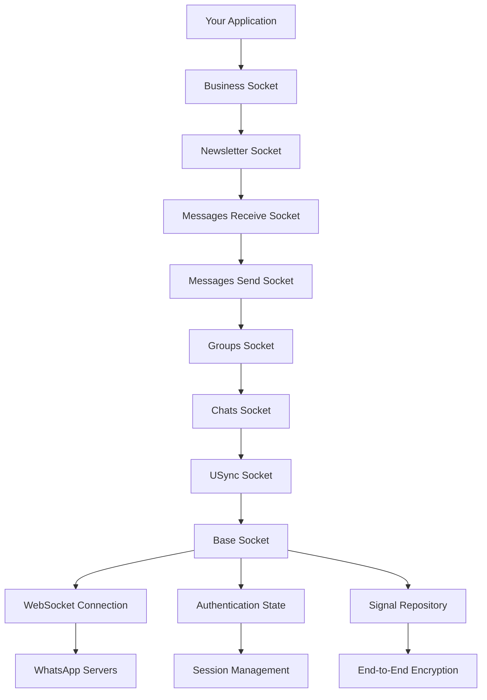
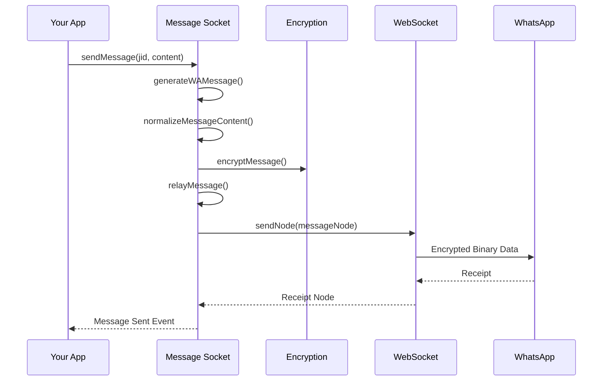
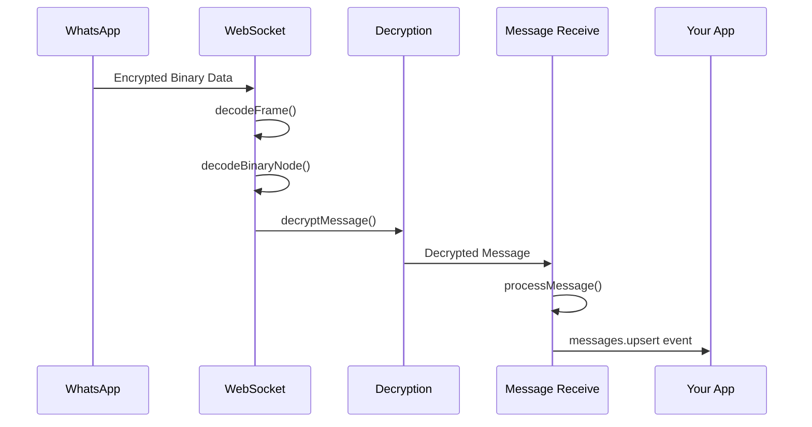

# Architecture Overview

Understanding Baileys' architecture is crucial for building robust WhatsApp applications. This section explains how Baileys is structured internally and how different components work together.

## High-Level Architecture

Baileys follows a layered architecture pattern where each layer builds upon the previous one, adding specific functionality:



## Core Components

### 1. Socket Layers

Each socket layer adds specific functionality while maintaining access to all lower-layer features:

#### Base Socket (`socket.ts`)
- **Purpose**: Core WebSocket connection and protocol handling
- **Responsibilities**:
  - WebSocket connection management
  - Noise protocol handshake
  - Binary message encoding/decoding
  - Authentication flow
  - Connection state management

```typescript
interface BaseSocket {
    ws: WebSocket
    ev: EventEmitter
    authState: AuthenticationState
    signalRepository: SignalRepository
    query: (node: BinaryNode) => Promise<BinaryNode>
    sendNode: (node: BinaryNode) => Promise<void>
    generateMessageTag: () => string
}
```

#### USync Socket (`usync.ts`)
- **Purpose**: User synchronization operations
- **Responsibilities**:
  - Contact synchronization
  - Device list management
  - User presence queries

#### Chats Socket (`chats.ts`)
- **Purpose**: Chat management and app state synchronization
- **Responsibilities**:
  - Chat metadata management
  - App state synchronization
  - Privacy settings
  - Message processing mutex

#### Groups Socket (`groups.ts`)
- **Purpose**: Group management operations
- **Responsibilities**:
  - Group creation and deletion
  - Participant management
  - Group metadata updates
  - Permission management

#### Messages Socket (`messages-send.ts`)
- **Purpose**: Message sending functionality
- **Responsibilities**:
  - Message composition and encoding
  - Media upload handling
  - Message retry logic
  - Receipt management

#### Messages Receive Socket (`messages-recv.ts`)
- **Purpose**: Message receiving and processing
- **Responsibilities**:
  - Incoming message decoding
  - Message retry handling
  - Poll vote decryption
  - Message acknowledgment

#### Newsletter Socket (`newsletter.ts`)
- **Purpose**: Newsletter/channel functionality
- **Responsibilities**:
  - Newsletter creation and management
  - Subscriber management
  - Newsletter message handling

#### Business Socket (`business.ts`)
- **Purpose**: WhatsApp Business features
- **Responsibilities**:
  - Product catalog management
  - Order processing
  - Business profile management

### 2. Protocol Implementation

#### WebSocket Management
```typescript
class WebSocketClient {
    private ws: WebSocket
    private eventEmitter: EventEmitter
    
    connect(): void
    send(data: Buffer): Promise<void>
    close(): void
    
    on(event: string, handler: Function): void
    off(event: string, handler: Function): void
}
```

#### Noise Protocol Handler
The Noise protocol provides secure communication:

```typescript
interface NoiseHandler {
    processHandshake(handshake: HandshakeMessage, noiseKey: KeyPair): Promise<Buffer>
    encodeFrame(data: Uint8Array): Buffer
    decodeFrame(data: Buffer): Uint8Array
}
```

#### Binary Protocol
WhatsApp uses a custom binary protocol for efficient communication:

```typescript
interface BinaryNode {
    tag: string
    attrs: { [key: string]: string }
    content?: BinaryNode[] | string | Uint8Array
}

function encodeBinaryNode(node: BinaryNode): Buffer
function decodeBinaryNode(buffer: Buffer): BinaryNode
```

### 3. Authentication System

#### Authentication State
```typescript
interface AuthenticationState {
    creds: AuthenticationCreds
    keys: SignalKeyStore
}

interface AuthenticationCreds {
    noiseKey: KeyPair
    signedIdentityKey: KeyPair
    signedPreKey: SignedKeyPair
    registrationId: number
    me?: Contact
    // ... other fields
}
```

#### Signal Protocol Integration
Baileys implements the Signal protocol for end-to-end encryption:

```typescript
interface SignalRepository {
    decryptMessage(opts: DecryptSignalProtoOpts): Promise<Uint8Array>
    encryptMessage(opts: EncryptMessageOpts): Promise<EncryptResult>
    decryptGroupMessage(opts: DecryptGroupSignalOpts): Promise<Uint8Array>
    encryptGroupMessage(opts: EncryptGroupMessageOpts): Promise<GroupEncryptResult>
}
```

### 4. Event System

Baileys uses an event-driven architecture with typed events:

```typescript
interface BaileysEventMap {
    'connection.update': ConnectionState
    'messages.upsert': { messages: WAMessage[], type: MessageUpsertType }
    'messages.update': WAMessageUpdate[]
    'messages.delete': { keys: WAMessageKey[] }
    'chats.upsert': Chat[]
    'chats.update': ChatUpdate[]
    'groups.update': Partial<GroupMetadata>[]
    // ... many more events
}
```

## Data Flow

### Message Sending Flow



### Message Receiving Flow



## Key Design Patterns

### 1. Layered Architecture
Each socket layer extends the previous one, creating a clean separation of concerns:

```typescript
const makeWASocket = (config: UserFacingSocketConfig) =>
    makeBusinessSocket({
        ...DEFAULT_CONNECTION_CONFIG,
        ...config
    })

const makeBusinessSocket = (config: SocketConfig) => {
    const sock = makeNewsletterSocket(makeGroupsSocket(config))
    // Add business-specific functionality
    return { ...sock, /* business methods */ }
}
```

### 2. Event-Driven Programming
All communication is event-based, allowing for reactive programming:

```typescript
sock.ev.on('messages.upsert', ({ messages }) => {
    // Handle new messages
})

sock.ev.on('connection.update', (update) => {
    // Handle connection changes
})
```

### 3. Mutex Pattern
Critical operations use mutexes to prevent race conditions:

```typescript
const processingMutex = makeMutex()

processingMutex.mutex(async () => {
    // Critical section - only one operation at a time
    await processMessage(message)
})
```

### 4. Repository Pattern
The Signal repository abstracts cryptographic operations:

```typescript
const signalRepository = makeLibSignalRepository(authState)
const encryptedData = await signalRepository.encryptMessage({
    jid: recipientJid,
    data: messageData
})
```

## Configuration System

Baileys uses a comprehensive configuration system:

```typescript
interface SocketConfig {
    // Connection settings
    waWebSocketUrl: string
    connectTimeoutMs: number
    keepAliveIntervalMs: number
    
    // Authentication
    auth: AuthenticationState
    
    // Features
    printQRInTerminal: boolean
    emitOwnEvents: boolean
    syncFullHistory: boolean
    
    // Caching
    userDevicesCache?: CacheStore
    msgRetryCounterCache?: CacheStore
    
    // Callbacks
    getMessage?: (key: WAMessageKey) => Promise<WAMessage | undefined>
    cachedGroupMetadata?: (jid: string) => Promise<GroupMetadata | undefined>
    
    // Customization
    patchMessageBeforeSending: (msg: proto.IWebMessageInfo) => proto.IWebMessageInfo
    shouldSyncHistoryMessage: (msg: proto.Message.IHistorySyncNotification) => boolean
}
```

## Memory Management

Baileys is designed to be memory-efficient:

1. **Streaming**: Media is processed as streams, not loaded into memory
2. **Caching**: Configurable caches with TTL for frequently accessed data
3. **Event Buffer**: Events are buffered and processed efficiently
4. **Lazy Loading**: Components are loaded only when needed

## Error Handling

Comprehensive error handling throughout the stack:

```typescript
// Connection errors
sock.ev.on('connection.update', ({ lastDisconnect }) => {
    if (lastDisconnect?.error) {
        const statusCode = (lastDisconnect.error as Boom)?.output?.statusCode
        // Handle different error types
    }
})

// Message errors
try {
    await sock.sendMessage(jid, content)
} catch (error) {
    if (error.output?.statusCode === 401) {
        // Handle authentication error
    }
}
```

## Next Steps

Now that you understand Baileys' architecture, explore these topics:

- **[Socket Layers](./socket-layers.md)**: Deep dive into each socket layer
- **[Data Flow](./data-flow.md)**: Detailed message processing flow
- **[Authentication](../04-authentication/README.md)**: How authentication works
- **[Message System](../05-messages/README.md)**: Message handling in detail

---

> **Key Takeaway**: Baileys' layered architecture allows you to use only the functionality you need while maintaining access to lower-level operations when required. Understanding this structure will help you build more efficient and maintainable applications.
