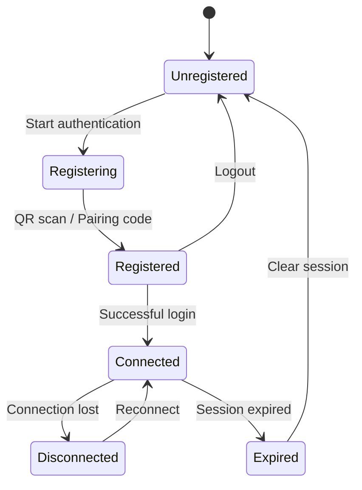

# Session Management

Proper session management is crucial for building reliable WhatsApp bots. This guide covers everything you need to know about managing authentication sessions in Baileys.

## Understanding Sessions

A WhatsApp session contains all the information needed to maintain a connection:

- **Identity Keys**: Unique device identification
- **Encryption Keys**: For secure message exchange
- **Registration Data**: Device registration information
- **Connection State**: Current connection status and metadata

## Session Lifecycle



## Session Storage Options

### 1. Multi-File Auth State (Recommended)

Best for development and small-scale deployments:

```typescript
import { useMultiFileAuthState } from '@whiskeysockets/baileys'

const { state, saveCreds } = await useMultiFileAuthState('auth_info')

// Creates folder structure:
// auth_info/
// ├── creds.json                    // Main credentials
// ├── pre-key-1.json               // Pre-keys for encryption
// ├── pre-key-2.json
// ├── session-user@s.whatsapp.net.json  // User sessions
// └── app-state-sync-key-*.json    // App state sync keys
```

### 2. Database Storage

For production applications with multiple instances:

```typescript
import { AuthenticationState, SignalDataSet } from '@whiskeysockets/baileys'
import { Pool } from 'pg' // PostgreSQL example

class DatabaseAuthState implements AuthenticationState {
    private db: Pool
    private userId: string
    
    constructor(db: Pool, userId: string) {
        this.db = db
        this.userId = userId
    }
    
    get creds(): AuthenticationCreds {
        return this._creds
    }
    
    get keys(): SignalKeyStore {
        return {
            get: async (type, ids) => {
                const query = `
                    SELECT key_id, key_data 
                    FROM signal_keys 
                    WHERE user_id = $1 AND key_type = $2 AND key_id = ANY($3)
                `
                const result = await this.db.query(query, [this.userId, type, ids])
                
                const keys: { [id: string]: any } = {}
                for (const row of result.rows) {
                    keys[row.key_id] = JSON.parse(row.key_data)
                }
                return keys
            },
            
            set: async (data) => {
                const client = await this.db.connect()
                try {
                    await client.query('BEGIN')
                    
                    for (const [type, typeData] of Object.entries(data)) {
                        for (const [id, keyData] of Object.entries(typeData)) {
                            if (keyData === null) {
                                // Delete key
                                await client.query(
                                    'DELETE FROM signal_keys WHERE user_id = $1 AND key_type = $2 AND key_id = $3',
                                    [this.userId, type, id]
                                )
                            } else {
                                // Upsert key
                                await client.query(`
                                    INSERT INTO signal_keys (user_id, key_type, key_id, key_data)
                                    VALUES ($1, $2, $3, $4)
                                    ON CONFLICT (user_id, key_type, key_id)
                                    DO UPDATE SET key_data = $4, updated_at = NOW()
                                `, [this.userId, type, id, JSON.stringify(keyData)])
                            }
                        }
                    }
                    
                    await client.query('COMMIT')
                } catch (error) {
                    await client.query('ROLLBACK')
                    throw error
                } finally {
                    client.release()
                }
            }
        }
    }
    
    async loadCreds(): Promise<void> {
        const result = await this.db.query(
            'SELECT creds_data FROM auth_creds WHERE user_id = $1',
            [this.userId]
        )
        
        if (result.rows.length > 0) {
            this._creds = JSON.parse(result.rows[0].creds_data)
        } else {
            this._creds = initAuthCreds()
        }
    }
    
    async saveCreds(): Promise<void> {
        await this.db.query(`
            INSERT INTO auth_creds (user_id, creds_data)
            VALUES ($1, $2)
            ON CONFLICT (user_id)
            DO UPDATE SET creds_data = $2, updated_at = NOW()
        `, [this.userId, JSON.stringify(this._creds)])
    }
}
```

### 3. Redis Storage

For distributed applications with session sharing:

```typescript
import Redis from 'ioredis'
import { AuthenticationState } from '@whiskeysockets/baileys'

class RedisAuthState implements AuthenticationState {
    private redis: Redis
    private keyPrefix: string
    
    constructor(redis: Redis, userId: string) {
        this.redis = redis
        this.keyPrefix = `baileys:${userId}`
    }
    
    get keys(): SignalKeyStore {
        return {
            get: async (type, ids) => {
                const pipeline = this.redis.pipeline()
                ids.forEach(id => {
                    pipeline.hget(`${this.keyPrefix}:keys:${type}`, id)
                })
                
                const results = await pipeline.exec()
                const keys: { [id: string]: any } = {}
                
                results?.forEach((result, index) => {
                    if (result && result[1]) {
                        keys[ids[index]] = JSON.parse(result[1] as string)
                    }
                })
                
                return keys
            },
            
            set: async (data) => {
                const pipeline = this.redis.pipeline()
                
                for (const [type, typeData] of Object.entries(data)) {
                    const hashKey = `${this.keyPrefix}:keys:${type}`
                    
                    for (const [id, keyData] of Object.entries(typeData)) {
                        if (keyData === null) {
                            pipeline.hdel(hashKey, id)
                        } else {
                            pipeline.hset(hashKey, id, JSON.stringify(keyData))
                        }
                    }
                }
                
                await pipeline.exec()
            }
        }
    }
    
    async loadCreds(): Promise<void> {
        const credsData = await this.redis.get(`${this.keyPrefix}:creds`)
        if (credsData) {
            this._creds = JSON.parse(credsData)
        } else {
            this._creds = initAuthCreds()
        }
    }
    
    async saveCreds(): Promise<void> {
        await this.redis.set(`${this.keyPrefix}:creds`, JSON.stringify(this._creds))
    }
}
```

## Session Validation

### Checking Session Health

```typescript
const validateSession = (authState: AuthenticationState): boolean => {
    const { creds } = authState
    
    // Check required fields
    if (!creds.registered || !creds.me) {
        return false
    }
    
    // Check key validity
    if (!creds.signedIdentityKey || !creds.signedPreKey) {
        return false
    }
    
    // Check if pre-key is not expired (optional)
    const preKeyAge = Date.now() - (creds.signedPreKey.timestampS || 0) * 1000
    const maxAge = 30 * 24 * 60 * 60 * 1000 // 30 days
    
    if (preKeyAge > maxAge) {
        console.warn('Pre-key is old, consider refreshing session')
    }
    
    return true
}
```

### Session Recovery

```typescript
const recoverSession = async (authState: AuthenticationState) => {
    try {
        // Attempt connection with existing session
        const sock = makeWASocket({ auth: authState })
        
        return new Promise((resolve, reject) => {
            const timeout = setTimeout(() => {
                reject(new Error('Session recovery timeout'))
            }, 30000)
            
            sock.ev.on('connection.update', ({ connection, lastDisconnect }) => {
                if (connection === 'open') {
                    clearTimeout(timeout)
                    resolve(sock)
                } else if (connection === 'close') {
                    const shouldReconnect = lastDisconnect?.error?.output?.statusCode !== DisconnectReason.loggedOut
                    
                    if (!shouldReconnect) {
                        clearTimeout(timeout)
                        reject(new Error('Session invalid, re-authentication required'))
                    }
                }
            })
        })
    } catch (error) {
        throw new Error(`Session recovery failed: ${error.message}`)
    }
}
```

## Session Persistence Strategies

### 1. Immediate Persistence

Save credentials immediately when updated:

```typescript
sock.ev.on('creds.update', async () => {
    try {
        await saveCreds()
        console.log('Credentials saved successfully')
    } catch (error) {
        console.error('Failed to save credentials:', error)
    }
})
```

### 2. Batched Persistence

Save credentials in batches to reduce I/O:

```typescript
class BatchedAuthState {
    private pendingSave = false
    private saveTimeout?: NodeJS.Timeout
    
    scheduleSave() {
        if (this.pendingSave) return
        
        this.pendingSave = true
        this.saveTimeout = setTimeout(async () => {
            try {
                await this.saveCreds()
                this.pendingSave = false
            } catch (error) {
                console.error('Batched save failed:', error)
                // Retry logic here
            }
        }, 1000) // Save after 1 second of inactivity
    }
    
    async forceSave() {
        if (this.saveTimeout) {
            clearTimeout(this.saveTimeout)
        }
        await this.saveCreds()
        this.pendingSave = false
    }
}
```

### 3. Transactional Persistence

Ensure data consistency with transactions:

```typescript
class TransactionalAuthState {
    async saveWithTransaction(creds: AuthenticationCreds, keys: SignalDataSet) {
        const transaction = await this.db.beginTransaction()
        
        try {
            // Save credentials
            await transaction.query(
                'UPDATE auth_creds SET creds_data = ? WHERE user_id = ?',
                [JSON.stringify(creds), this.userId]
            )
            
            // Save keys
            for (const [type, typeData] of Object.entries(keys)) {
                for (const [id, keyData] of Object.entries(typeData)) {
                    if (keyData === null) {
                        await transaction.query(
                            'DELETE FROM signal_keys WHERE user_id = ? AND key_type = ? AND key_id = ?',
                            [this.userId, type, id]
                        )
                    } else {
                        await transaction.query(
                            'REPLACE INTO signal_keys (user_id, key_type, key_id, key_data) VALUES (?, ?, ?, ?)',
                            [this.userId, type, id, JSON.stringify(keyData)]
                        )
                    }
                }
            }
            
            await transaction.commit()
        } catch (error) {
            await transaction.rollback()
            throw error
        }
    }
}
```

## Session Migration

### Migrating Between Storage Types

```typescript
const migrateSession = async (
    fromAuth: AuthenticationState,
    toAuth: AuthenticationState
) => {
    // Copy credentials
    toAuth.creds = { ...fromAuth.creds }
    
    // Copy all key types
    const keyTypes = ['pre-key', 'session', 'sender-key', 'sender-key-memory', 'app-state-sync-key', 'app-state-sync-version']
    
    for (const keyType of keyTypes) {
        // Get all keys of this type (this is a simplified example)
        const keys = await fromAuth.keys.get(keyType as any, [])
        if (Object.keys(keys).length > 0) {
            await toAuth.keys.set({ [keyType]: keys })
        }
    }
    
    console.log('Session migration completed')
}
```

### Backup and Restore

```typescript
const backupSession = async (authState: AuthenticationState): Promise<string> => {
    const backup = {
        creds: authState.creds,
        keys: {},
        timestamp: Date.now()
    }
    
    // Backup all keys
    const keyTypes = ['pre-key', 'session', 'sender-key', 'app-state-sync-key']
    for (const keyType of keyTypes) {
        backup.keys[keyType] = await authState.keys.get(keyType as any, [])
    }
    
    return JSON.stringify(backup)
}

const restoreSession = async (backupData: string): Promise<AuthenticationState> => {
    const backup = JSON.parse(backupData)
    
    // Validate backup
    if (!backup.creds || !backup.keys) {
        throw new Error('Invalid backup data')
    }
    
    // Create new auth state
    const authState = createAuthState()
    authState.creds = backup.creds
    
    // Restore keys
    await authState.keys.set(backup.keys)
    
    return authState
}
```

## Session Monitoring

### Health Checks

```typescript
class SessionMonitor {
    private lastActivity = Date.now()
    private healthCheckInterval?: NodeJS.Timeout
    
    startMonitoring(sock: WASocket) {
        // Monitor connection events
        sock.ev.on('connection.update', ({ connection }) => {
            if (connection === 'open') {
                this.lastActivity = Date.now()
            }
        })
        
        // Monitor message events
        sock.ev.on('messages.upsert', () => {
            this.lastActivity = Date.now()
        })
        
        // Periodic health check
        this.healthCheckInterval = setInterval(() => {
            this.performHealthCheck(sock)
        }, 60000) // Every minute
    }
    
    private performHealthCheck(sock: WASocket) {
        const timeSinceActivity = Date.now() - this.lastActivity
        const maxInactivity = 5 * 60 * 1000 // 5 minutes
        
        if (timeSinceActivity > maxInactivity) {
            console.warn('Session appears inactive, checking connection...')
            
            // Send ping to check connection
            sock.query({
                tag: 'iq',
                attrs: { type: 'get', xmlns: 'w:p' },
                content: [{ tag: 'ping', attrs: {} }]
            }).catch(error => {
                console.error('Health check failed:', error)
                // Trigger reconnection
            })
        }
    }
    
    stopMonitoring() {
        if (this.healthCheckInterval) {
            clearInterval(this.healthCheckInterval)
        }
    }
}
```

### Session Analytics

```typescript
class SessionAnalytics {
    private metrics = {
        connectionCount: 0,
        disconnectionCount: 0,
        messagesSent: 0,
        messagesReceived: 0,
        errors: 0
    }
    
    trackConnection(sock: WASocket) {
        sock.ev.on('connection.update', ({ connection }) => {
            if (connection === 'open') {
                this.metrics.connectionCount++
            } else if (connection === 'close') {
                this.metrics.disconnectionCount++
            }
        })
        
        sock.ev.on('messages.upsert', ({ messages }) => {
            this.metrics.messagesReceived += messages.length
        })
        
        // Track sent messages (you'd need to wrap sendMessage)
        const originalSendMessage = sock.sendMessage
        sock.sendMessage = async (...args) => {
            try {
                const result = await originalSendMessage.apply(sock, args)
                this.metrics.messagesSent++
                return result
            } catch (error) {
                this.metrics.errors++
                throw error
            }
        }
    }
    
    getMetrics() {
        return { ...this.metrics }
    }
    
    getUptime() {
        return this.metrics.connectionCount > 0 ? 
            (this.metrics.connectionCount / (this.metrics.connectionCount + this.metrics.disconnectionCount)) * 100 : 0
    }
}
```

## Best Practices

### 1. Regular Backups

```typescript
const scheduleBackups = (authState: AuthenticationState) => {
    setInterval(async () => {
        try {
            const backup = await backupSession(authState)
            await fs.writeFile(`backup-${Date.now()}.json`, backup)
            console.log('Session backup created')
        } catch (error) {
            console.error('Backup failed:', error)
        }
    }, 24 * 60 * 60 * 1000) // Daily backups
}
```

### 2. Graceful Shutdown

```typescript
const gracefulShutdown = async (sock: WASocket, authState: AuthenticationState) => {
    console.log('Shutting down gracefully...')
    
    // Save current state
    await authState.saveCreds()
    
    // Close connection
    sock.end()
    
    console.log('Shutdown complete')
}

process.on('SIGINT', () => gracefulShutdown(sock, authState))
process.on('SIGTERM', () => gracefulShutdown(sock, authState))
```

### 3. Error Recovery

```typescript
const setupErrorRecovery = (sock: WASocket, authState: AuthenticationState) => {
    sock.ev.on('connection.update', async ({ connection, lastDisconnect }) => {
        if (connection === 'close') {
            const error = lastDisconnect?.error
            const statusCode = error?.output?.statusCode
            
            switch (statusCode) {
                case DisconnectReason.badSession:
                    console.log('Bad session, clearing auth state...')
                    await authState.keys.clear?.()
                    // Restart with fresh authentication
                    break
                    
                case DisconnectReason.connectionLost:
                    console.log('Connection lost, attempting recovery...')
                    await recoverSession(authState)
                    break
                    
                default:
                    console.log('Unexpected disconnection:', error)
                    // Implement retry logic
            }
        }
    })
}
```

## Next Steps

- **[QR Code Authentication](./qr-code-auth.md)**: Implementing QR code authentication
- **[Pairing Code Authentication](./pairing-code-auth.md)**: Using pairing codes
- **[Message System](../05-messages/README.md)**: Learn about message handling

---

> **Important**: Always implement proper error handling and backup strategies for production applications. Session data is critical for maintaining WhatsApp connections.
