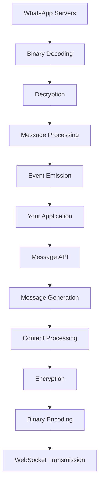

# Message System

The message system is the core of any WhatsApp bot. This comprehensive guide covers everything about sending, receiving, and processing messages in Baileys.

## Message Architecture



## Message Types

WhatsApp supports various message types, each with specific properties and use cases:

### Text Messages

The most basic message type for sending plain text:

```typescript
await sock.sendMessage(jid, {
    text: 'Hello, World!'
})

// With formatting
await sock.sendMessage(jid, {
    text: '*Bold* _italic_ ~strikethrough~ ```monospace```'
})

// With mentions
await sock.sendMessage(jid, {
    text: 'Hello @1234567890!',
    mentions: ['1234567890@s.whatsapp.net']
})
```

### Extended Text Messages

Text messages with additional features:

```typescript
// With link preview
await sock.sendMessage(jid, {
    text: 'Check out https://github.com/WhiskeySockets/Baileys'
})

// With custom link preview
await sock.sendMessage(jid, {
    text: 'Custom preview',
    linkPreview: {
        url: 'https://example.com',
        title: 'Custom Title',
        description: 'Custom description',
        mediaType: 1,
        thumbnail: thumbnailBuffer
    }
})
```

### Media Messages

#### Image Messages
```typescript
// From file path
await sock.sendMessage(jid, {
    image: { url: './image.jpg' },
    caption: 'Image caption'
})

// From buffer
await sock.sendMessage(jid, {
    image: imageBuffer,
    caption: 'Image from buffer'
})

// From URL
await sock.sendMessage(jid, {
    image: { url: 'https://example.com/image.jpg' },
    caption: 'Image from URL'
})
```

#### Video Messages
```typescript
await sock.sendMessage(jid, {
    video: { url: './video.mp4' },
    caption: 'Video caption',
    gifPlayback: false, // Set to true for GIF-like playback
    ptv: false // Set to true for video note (circular video)
})
```

#### Audio Messages
```typescript
// Regular audio
await sock.sendMessage(jid, {
    audio: { url: './audio.mp3' },
    mimetype: 'audio/mp4'
})

// Voice message (PTT - Push to Talk)
await sock.sendMessage(jid, {
    audio: { url: './voice.ogg' },
    mimetype: 'audio/ogg; codecs=opus',
    ptt: true
})
```

#### Document Messages
```typescript
await sock.sendMessage(jid, {
    document: { url: './document.pdf' },
    mimetype: 'application/pdf',
    fileName: 'document.pdf',
    caption: 'Document caption'
})
```

### Interactive Messages

#### Location Messages
```typescript
await sock.sendMessage(jid, {
    location: {
        degreesLatitude: 24.121231,
        degreesLongitude: 55.1121221,
        name: 'Location Name',
        address: '123 Street Name'
    }
})
```

#### Contact Messages
```typescript
const vcard = 'BEGIN:VCARD\n' +
             'VERSION:3.0\n' +
             'FN:John Doe\n' +
             'ORG:Company Name\n' +
             'TEL;type=CELL;type=VOICE;waid=1234567890:+1 234 567 890\n' +
             'END:VCARD'

await sock.sendMessage(jid, {
    contacts: {
        displayName: 'John Doe',
        contacts: [{ vcard }]
    }
})
```

#### Poll Messages
```typescript
await sock.sendMessage(jid, {
    poll: {
        name: 'What is your favorite color?',
        values: ['Red', 'Blue', 'Green', 'Yellow'],
        selectableCount: 1
    }
})
```

### Reaction Messages

```typescript
await sock.sendMessage(jid, {
    react: {
        text: '👍', // emoji or empty string to remove
        key: messageKey // key of the message to react to
    }
})
```

### Message Modifications

#### Edit Messages
```typescript
await sock.sendMessage(jid, {
    text: 'Updated message text',
    edit: messageKey // key of the message to edit
})
```

#### Delete Messages
```typescript
await sock.sendMessage(jid, {
    delete: messageKey // key of the message to delete
})
```

## Message Structure

### WAMessage Interface

```typescript
interface WAMessage {
    key: WAMessageKey
    message?: WAMessageContent
    messageTimestamp?: number
    status?: WAMessageStatus
    participant?: string
    pushName?: string
    broadcast?: boolean
    messageStubType?: WAMessageStubType
    messageStubParameters?: string[]
}
```

### Message Key

```typescript
interface WAMessageKey {
    remoteJid?: string    // Chat JID
    fromMe?: boolean      // Sent by us
    id?: string          // Unique message ID
    participant?: string  // Sender in group chats
}
```

### Message Content Types

```typescript
type WAMessageContent = {
    conversation?: string
    extendedTextMessage?: ExtendedTextMessage
    imageMessage?: ImageMessage
    videoMessage?: VideoMessage
    audioMessage?: AudioMessage
    documentMessage?: DocumentMessage
    locationMessage?: LocationMessage
    contactMessage?: ContactMessage
    contactsArrayMessage?: ContactsArrayMessage
    pollCreationMessage?: PollCreationMessage
    reactionMessage?: ReactionMessage
    // ... many more types
}
```

## Sending Messages

### Basic Sending

```typescript
const sendMessage = async (jid: string, content: AnyMessageContent) => {
    try {
        const result = await sock.sendMessage(jid, content)
        console.log('Message sent:', result.key.id)
        return result
    } catch (error) {
        console.error('Failed to send message:', error)
        throw error
    }
}
```

### Advanced Sending Options

```typescript
await sock.sendMessage(jid, content, {
    // Quote another message
    quoted: originalMessage,
    
    // Disappearing message (ephemeral)
    ephemeralExpiration: 7 * 24 * 60 * 60, // 7 days
    
    // Message ID override
    messageId: 'custom-message-id',
    
    // Additional attributes
    additionalAttributes: {
        'custom-attr': 'value'
    },
    
    // Status broadcast recipients
    statusJidList: ['user1@s.whatsapp.net', 'user2@s.whatsapp.net']
})
```

### Bulk Messaging

```typescript
const sendBulkMessages = async (recipients: string[], content: AnyMessageContent) => {
    const results = []
    
    for (const jid of recipients) {
        try {
            const result = await sock.sendMessage(jid, content)
            results.push({ jid, success: true, messageId: result.key.id })
            
            // Rate limiting
            await new Promise(resolve => setTimeout(resolve, 1000))
        } catch (error) {
            results.push({ jid, success: false, error: error.message })
        }
    }
    
    return results
}
```

## Receiving Messages

### Message Event Handling

```typescript
sock.ev.on('messages.upsert', ({ messages, type }) => {
    for (const message of messages) {
        if (type === 'notify') {
            handleIncomingMessage(message)
        }
    }
})

const handleIncomingMessage = (message: WAMessage) => {
    // Skip messages from status broadcast
    if (message.key.remoteJid === 'status@broadcast') return
    
    // Skip own messages
    if (message.key.fromMe) return
    
    // Extract message content
    const content = getMessageContent(message)
    const sender = message.key.remoteJid!
    const isGroup = sender.endsWith('@g.us')
    
    console.log(`Message from ${sender}: ${content}`)
    
    // Process based on message type
    processMessageContent(message, content, sender, isGroup)
}
```

### Content Extraction

```typescript
const getMessageContent = (message: WAMessage): string => {
    const content = message.message
    
    if (content?.conversation) {
        return content.conversation
    }
    
    if (content?.extendedTextMessage?.text) {
        return content.extendedTextMessage.text
    }
    
    if (content?.imageMessage?.caption) {
        return content.imageMessage.caption || '[Image]'
    }
    
    if (content?.videoMessage?.caption) {
        return content.videoMessage.caption || '[Video]'
    }
    
    if (content?.audioMessage) {
        return '[Audio]'
    }
    
    if (content?.documentMessage) {
        return `[Document: ${content.documentMessage.fileName}]`
    }
    
    if (content?.locationMessage) {
        return '[Location]'
    }
    
    if (content?.contactMessage) {
        return '[Contact]'
    }
    
    if (content?.pollCreationMessage) {
        return `[Poll: ${content.pollCreationMessage.name}]`
    }
    
    return '[Unknown message type]'
}
```

### Message Type Detection

```typescript
import { getContentType } from '@whiskeysockets/baileys'

const getMessageType = (message: WAMessage): string => {
    return getContentType(message.message) || 'unknown'
}

const processMessageByType = (message: WAMessage) => {
    const messageType = getMessageType(message)
    
    switch (messageType) {
        case 'conversation':
        case 'extendedTextMessage':
            handleTextMessage(message)
            break
            
        case 'imageMessage':
            handleImageMessage(message)
            break
            
        case 'videoMessage':
            handleVideoMessage(message)
            break
            
        case 'audioMessage':
            handleAudioMessage(message)
            break
            
        case 'documentMessage':
            handleDocumentMessage(message)
            break
            
        case 'locationMessage':
            handleLocationMessage(message)
            break
            
        case 'contactMessage':
            handleContactMessage(message)
            break
            
        case 'pollCreationMessage':
            handlePollMessage(message)
            break
            
        case 'reactionMessage':
            handleReactionMessage(message)
            break
            
        default:
            console.log('Unhandled message type:', messageType)
    }
}
```

## Message Updates

### Handling Message Updates

```typescript
sock.ev.on('messages.update', (updates) => {
    for (const update of updates) {
        const { key, update: messageUpdate } = update
        
        if (messageUpdate.status) {
            handleStatusUpdate(key, messageUpdate.status)
        }
        
        if (messageUpdate.pollUpdates) {
            handlePollUpdate(key, messageUpdate.pollUpdates)
        }
        
        if (messageUpdate.reactions) {
            handleReactionUpdate(key, messageUpdate.reactions)
        }
    }
})

const handleStatusUpdate = (key: WAMessageKey, status: number) => {
    const statusText = {
        0: 'ERROR',
        1: 'PENDING',
        2: 'SERVER_ACK',
        3: 'DELIVERY_ACK',
        4: 'READ'
    }[status] || 'UNKNOWN'
    
    console.log(`Message ${key.id} status: ${statusText}`)
}
```

### Poll Updates

```typescript
import { getAggregateVotesInPollMessage } from '@whiskeysockets/baileys'

const handlePollUpdate = async (key: WAMessageKey, pollUpdates: any[]) => {
    // Get the original poll message
    const pollMessage = await getMessage(key)
    
    if (pollMessage) {
        const aggregatedVotes = getAggregateVotesInPollMessage({
            message: pollMessage,
            pollUpdates
        })
        
        console.log('Poll results:', aggregatedVotes)
    }
}
```

## Message Receipts

### Sending Receipts

```typescript
// Mark messages as read
await sock.readMessages([messageKey])

// Send delivery receipt
await sock.sendReceipt(jid, participant, [messageKey], 'read')
```

### Receipt Events

```typescript
sock.ev.on('message-receipt.update', (receipts) => {
    for (const receipt of receipts) {
        console.log(`Receipt from ${receipt.key.participant}: ${receipt.receipt.receiptTimestamp}`)
    }
})
```

## Error Handling

### Message Send Errors

```typescript
const sendMessageWithRetry = async (
    jid: string, 
    content: AnyMessageContent, 
    maxRetries = 3
) => {
    for (let attempt = 1; attempt <= maxRetries; attempt++) {
        try {
            return await sock.sendMessage(jid, content)
        } catch (error) {
            console.log(`Send attempt ${attempt} failed:`, error.message)
            
            if (attempt === maxRetries) {
                throw new Error(`Failed to send message after ${maxRetries} attempts`)
            }
            
            // Exponential backoff
            await new Promise(resolve => 
                setTimeout(resolve, Math.pow(2, attempt) * 1000)
            )
        }
    }
}
```

### Message Processing Errors

```typescript
const safeMessageHandler = (handler: (message: WAMessage) => Promise<void>) => {
    return async (message: WAMessage) => {
        try {
            await handler(message)
        } catch (error) {
            console.error('Message handler error:', error)
            
            // Optional: Send error notification
            if (message.key.remoteJid && !message.key.fromMe) {
                await sock.sendMessage(message.key.remoteJid, {
                    text: '❌ An error occurred while processing your message.'
                }).catch(() => {}) // Ignore send errors
            }
        }
    }
}

// Usage
sock.ev.on('messages.upsert', ({ messages }) => {
    messages.forEach(safeMessageHandler(handleIncomingMessage))
})
```

## Performance Optimization

### Message Batching

```typescript
class MessageBatcher {
    private batch: WAMessage[] = []
    private batchTimeout?: NodeJS.Timeout
    
    addMessage(message: WAMessage) {
        this.batch.push(message)
        
        if (this.batch.length >= 10) {
            this.processBatch()
        } else {
            this.scheduleBatchProcessing()
        }
    }
    
    private scheduleBatchProcessing() {
        if (this.batchTimeout) return
        
        this.batchTimeout = setTimeout(() => {
            this.processBatch()
        }, 1000)
    }
    
    private processBatch() {
        if (this.batchTimeout) {
            clearTimeout(this.batchTimeout)
            this.batchTimeout = undefined
        }
        
        const messages = this.batch.splice(0)
        if (messages.length > 0) {
            this.processMessages(messages)
        }
    }
    
    private async processMessages(messages: WAMessage[]) {
        // Process messages in batch
        for (const message of messages) {
            await handleIncomingMessage(message)
        }
    }
}
```

### Caching Strategies

```typescript
import NodeCache from '@cacheable/node-cache'

const messageCache = new NodeCache({
    stdTTL: 3600, // 1 hour
    checkperiod: 600 // Check for expired keys every 10 minutes
})

const getCachedMessage = (key: WAMessageKey): WAMessage | undefined => {
    return messageCache.get(key.id!)
}

const cacheMessage = (message: WAMessage) => {
    if (message.key.id) {
        messageCache.set(message.key.id, message)
    }
}
```

## Next Steps

- **[Message Types](./message-types.md)**: Detailed guide to all message types
- **[Sending Messages](./sending-messages.md)**: Advanced sending techniques
- **[Receiving Messages](./receiving-messages.md)**: Message processing patterns
- **[Media Handling](../07-media/README.md)**: Working with media messages

---

> **Key Concepts**: Understanding message structure and event handling is crucial for building responsive WhatsApp bots. Always handle errors gracefully and implement proper retry mechanisms.
