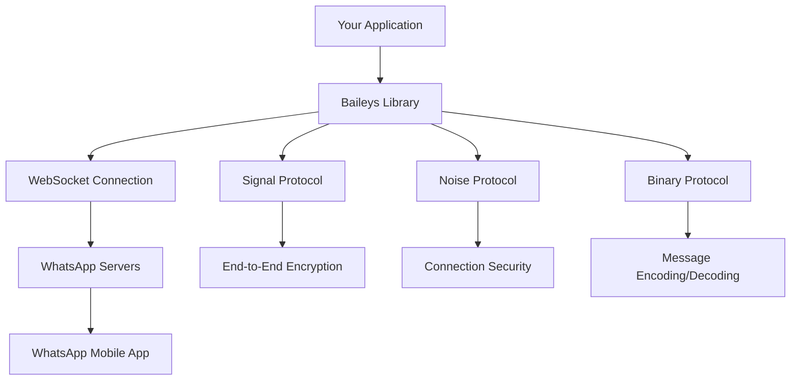

# Introduction to Baileys

Welcome to Baileys, the most comprehensive and powerful TypeScript library for building WhatsApp bots and automation tools. This documentation will guide you through everything you need to know to build production-ready WhatsApp applications.

## What is Baileys?

Baileys is a WebSockets-based TypeScript library that allows you to interact with the WhatsApp Web API directly, without requiring a browser or Selenium. It provides a complete implementation of the WhatsApp Web protocol, enabling you to:

- **Send and receive messages** of all types (text, media, documents, etc.)
- **Manage groups** (create, modify, add/remove participants)
- **Handle authentication** with QR codes or pairing codes
- **Process events** in real-time (messages, presence updates, group changes)
- **Access business features** (catalogs, orders, newsletters)
- **Maintain sessions** across restarts and deployments

## Why Choose Baileys?

### 🚀 **Performance & Efficiency**
- **No browser overhead**: Direct WebSocket connection saves ~500MB of RAM compared to Selenium-based solutions
- **Efficient protocol implementation**: Optimized binary protocol handling
- **Minimal dependencies**: Lightweight core with optional peer dependencies

### 🔒 **Security & Reliability**
- **End-to-end encryption**: Full Signal protocol implementation
- **Session persistence**: Robust authentication state management
- **Error handling**: Comprehensive error recovery and retry mechanisms

### 🛠 **Developer Experience**
- **TypeScript first**: Complete type safety and IntelliSense support
- **Event-driven architecture**: Reactive programming with typed events
- **Extensive documentation**: Comprehensive guides and examples
- **Active community**: Discord support and regular updates

### 🌟 **Feature Complete**
- **Multi-device support**: Works with WhatsApp's latest multi-device API
- **All message types**: Text, media, contacts, locations, polls, reactions
- **Group management**: Full administrative capabilities
- **Business features**: Catalogs, orders, newsletters, and more

## How Baileys Works

Baileys implements the WhatsApp Web protocol by:

1. **Establishing a WebSocket connection** to WhatsApp's servers
2. **Performing cryptographic handshake** using the Noise protocol
3. **Authenticating** via QR code scan or pairing code
4. **Exchanging encrypted messages** using the Signal protocol
5. **Processing binary protocol messages** in real-time



## Core Concepts

### Socket Architecture
Baileys uses a layered socket architecture where each layer adds specific functionality:

- **Base Socket**: WebSocket connection and protocol handling
- **Auth Socket**: Authentication and session management  
- **Message Socket**: Message sending and receiving
- **Group Socket**: Group management operations
- **Business Socket**: Business and advanced features

### Event-Driven Programming
Everything in Baileys is event-driven. Your application reacts to events like:

```typescript
sock.ev.on('messages.upsert', ({ messages }) => {
    // Handle new messages
})

sock.ev.on('connection.update', (update) => {
    // Handle connection state changes
})

sock.ev.on('groups.update', (updates) => {
    // Handle group metadata changes
})
```

### Authentication State
Baileys maintains authentication state that includes:
- **Credentials**: Identity keys, registration info
- **Signal keys**: Encryption keys for secure communication
- **Session data**: Connection state and metadata

## What You'll Learn

This documentation will teach you:

1. **Getting Started**: Installation, setup, and your first bot
2. **Core Architecture**: Understanding Baileys' internal structure
3. **Authentication**: Managing sessions and connections
4. **Message Handling**: Sending, receiving, and processing messages
5. **Media Management**: Working with images, videos, and documents
6. **Group Operations**: Creating and managing WhatsApp groups
7. **Advanced Features**: Business tools, newsletters, and customization
8. **Production Deployment**: Scaling, monitoring, and best practices

## Prerequisites

To get the most out of this documentation, you should have:

- **Node.js knowledge**: Familiarity with Node.js and npm/yarn
- **TypeScript basics**: Understanding of TypeScript syntax and types
- **Async programming**: Knowledge of Promises, async/await
- **Event-driven patterns**: Understanding of EventEmitter pattern

## Getting Help

If you need assistance:

- 📖 **Documentation**: Start with this comprehensive guide
- 💬 **Discord**: Join our [Discord community](https://discord.gg/WeJM5FP9GG)
- 🐛 **GitHub Issues**: Report bugs and request features
- 💡 **Discussions**: Ask questions in GitHub Discussions

## Next Steps

Ready to get started? Let's move on to [Installation & Setup](../02-installation/README.md) to get Baileys running on your system.

---

> **Note**: This documentation covers Baileys v6.7.x. For older versions, please refer to the legacy documentation or consider upgrading to the latest version for the best experience.
