# Data Flow in Baileys

Understanding how data flows through Baileys is essential for building efficient applications and debugging issues. This document explains the complete data flow for various operations.

## Message Sending Flow

### Complete Flow Diagram

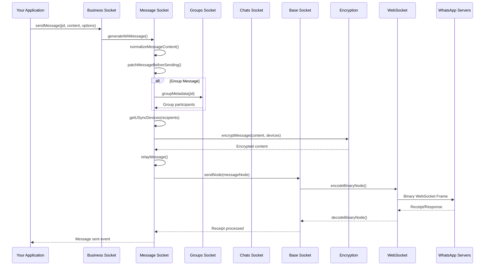

### Step-by-Step Breakdown

#### 1. Message Initiation
```typescript
// Your application calls
await sock.sendMessage(jid, { text: 'Hello!' }, options)
```

#### 2. Content Processing
```typescript
// In messages-send.ts
const fullMsg = await generateWAMessage(jid, content, {
    logger,
    userJid: meId,
    getUrlInfo: text => getUrlInfo(text, {
        thumbnailWidth: linkPreviewImageThumbnailWidth,
        fetchOpts: { timeout: 3000, ...axiosOptions }
    }),
    upload: waUploadToServer,
    mediaCache,
    options
})
```

#### 3. Content Normalization
```typescript
const normalizedContent = normalizeMessageContent(content)
// Handles different message types:
// - Text messages
// - Media messages (image, video, audio, document)
// - Location messages
// - Contact messages
// - Poll messages
```

#### 4. Device Resolution
```typescript
const devices = await getUSyncDevices([jid])
// Gets all devices for the recipient
// Handles multi-device scenarios
```

#### 5. Encryption
```typescript
const encryptedContent = await signalRepository.encryptMessage({
    jid: deviceJid,
    data: messageBuffer
})
```

#### 6. Message Relay
```typescript
await relayMessage(jid, fullMsg.message!, {
    messageId: fullMsg.key.id!,
    additionalAttributes,
    statusJidList: options.statusJidList
})
```

## Message Receiving Flow

### Complete Flow Diagram

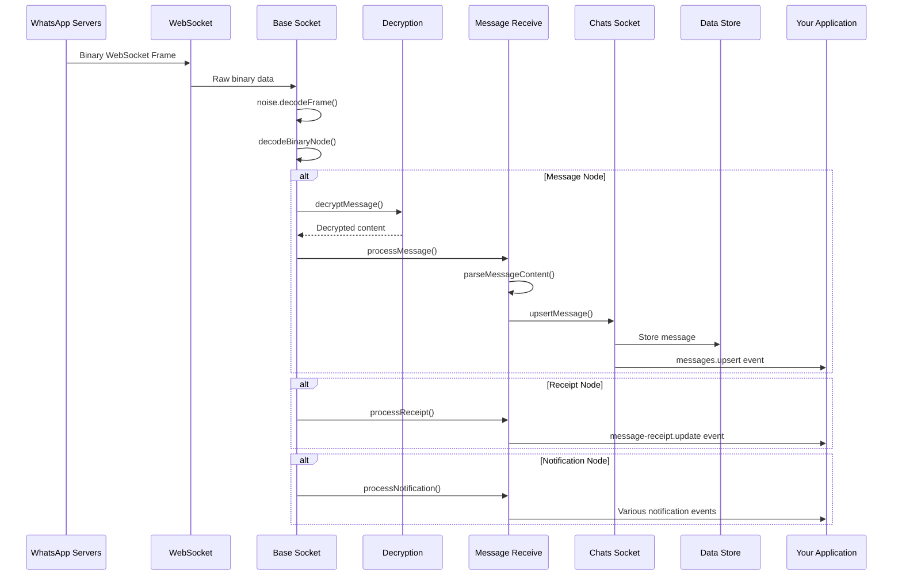

### Step-by-Step Breakdown

#### 1. Raw Data Reception
```typescript
// WebSocket receives binary frame
ws.on('message', (data: Buffer) => {
    const decrypted = noise.decodeFrame(data)
    const node = decodeBinaryNode(decrypted)
    processIncomingNode(node)
})
```

#### 2. Node Type Processing
```typescript
// Different node types are handled differently
switch (node.tag) {
    case 'message':
        await processMessage(node)
        break
    case 'receipt':
        await processReceipt(node)
        break
    case 'notification':
        await processNotification(node)
        break
}
```

#### 3. Message Decryption
```typescript
const decryptedMessage = await signalRepository.decryptMessage({
    jid: senderJid,
    type: encType, // 'pkmsg' or 'msg'
    ciphertext: encryptedContent
})
```

#### 4. Content Parsing
```typescript
const messageContent = proto.Message.decode(decryptedMessage)
const processedMessage = await processMessage(messageContent)
```

#### 5. Event Emission
```typescript
ev.emit('messages.upsert', {
    messages: [processedMessage],
    type: 'notify'
})
```

## Authentication Flow

### Initial Connection

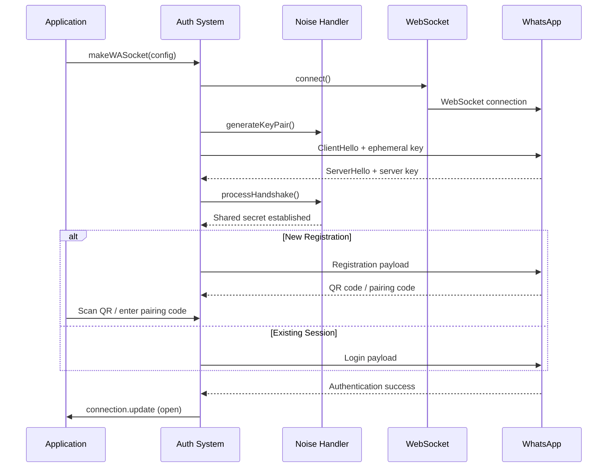

### Session Restoration

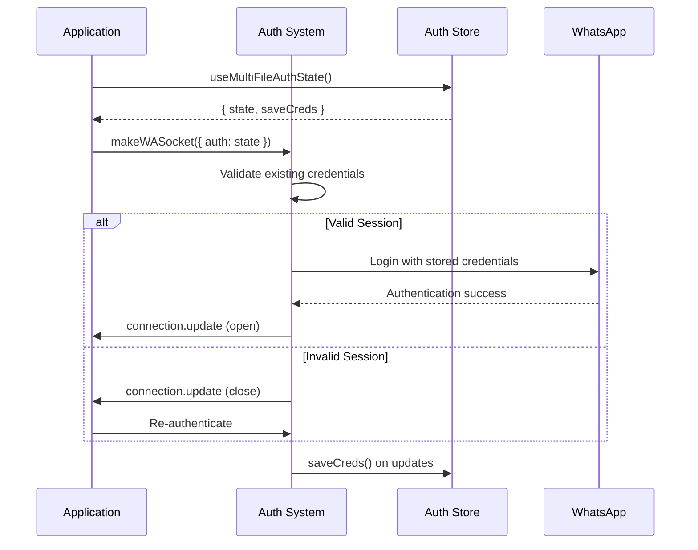

## Group Operations Flow

### Group Creation

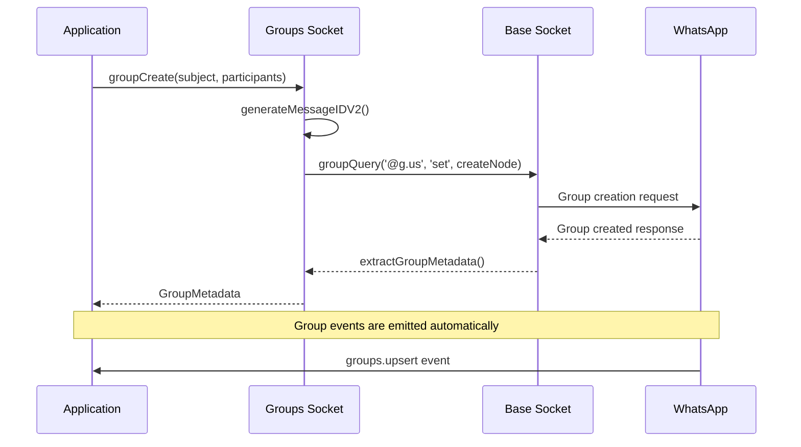

### Participant Management

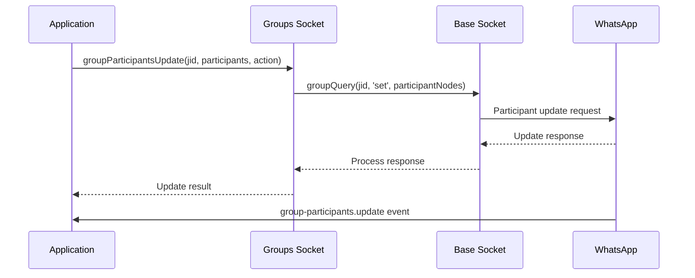

## Media Handling Flow

### Media Upload

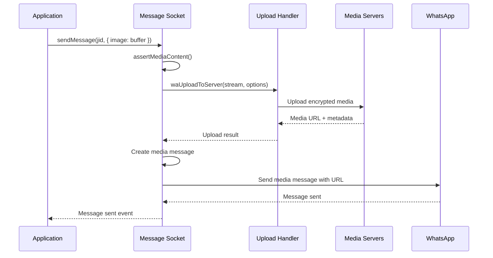

### Media Download

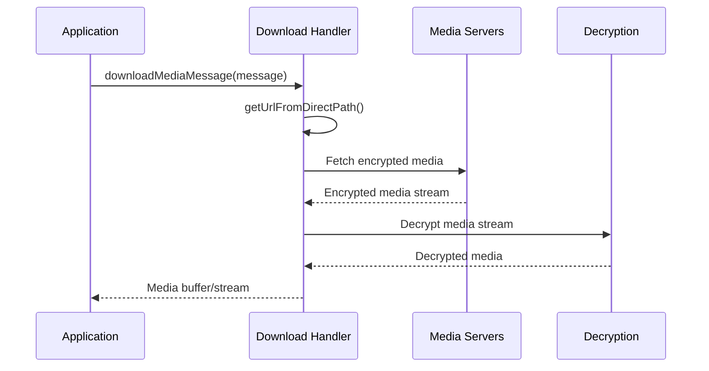

## Event Processing Flow

### Event Buffer System

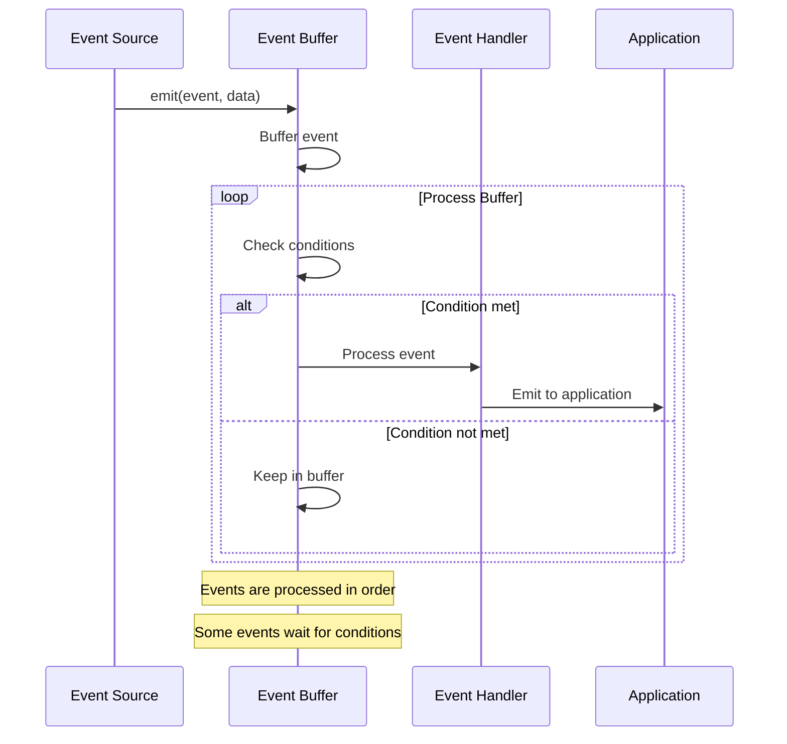

### Event Types and Flow

```typescript
// Connection events
sock.ev.on('connection.update', (update) => {
    // Immediate processing
})

// Message events (buffered)
sock.ev.on('messages.upsert', ({ messages, type }) => {
    // Processed after connection is stable
})

// Chat events (buffered)
sock.ev.on('chats.upsert', (chats) => {
    // Processed with app state sync
})
```

## Error Handling Flow

### Connection Errors

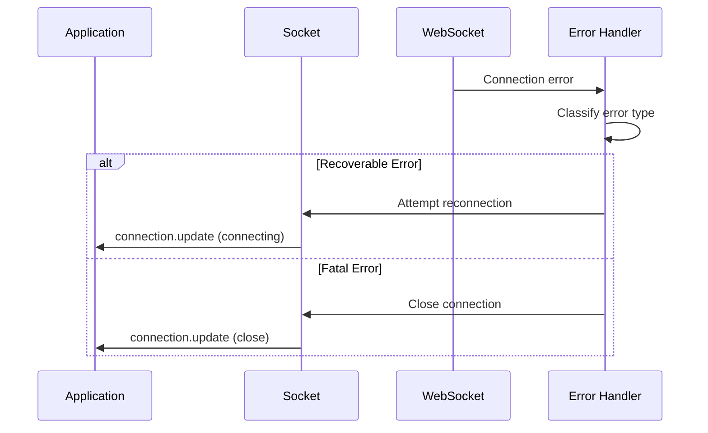

### Message Errors

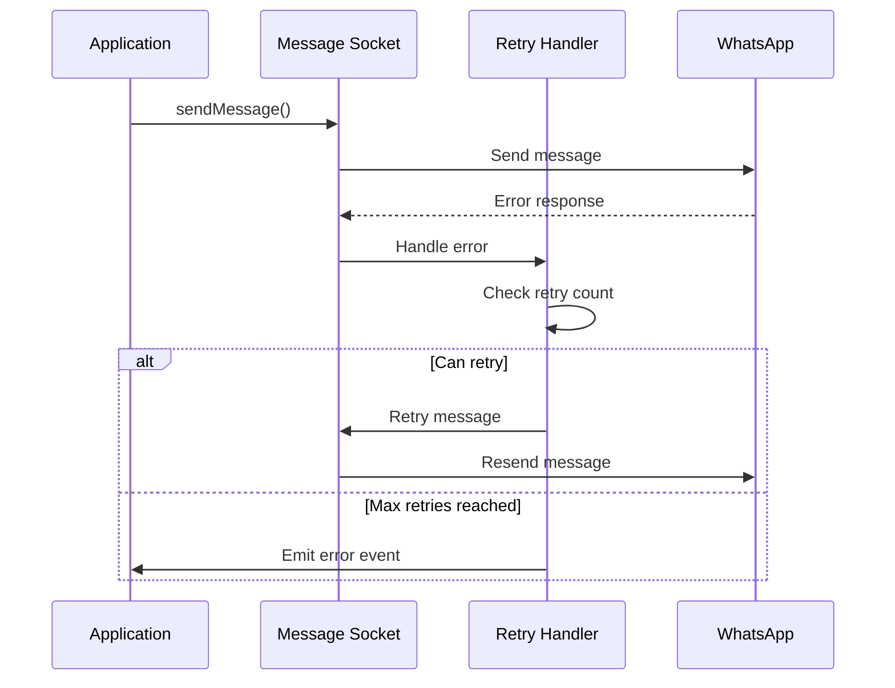

## Performance Considerations

### Batching Operations
```typescript
// Messages are processed in batches
const processingMutex = makeMutex()

processingMutex.mutex(async () => {
    // Process multiple messages together
    for (const message of messages) {
        await processMessage(message)
    }
})
```

### Caching Strategy
```typescript
// Multiple cache layers
const userDevicesCache = new NodeCache({ stdTTL: 300 }) // 5 minutes
const msgRetryCounterCache = new NodeCache({ stdTTL: 3600 }) // 1 hour
const mediaCache = new NodeCache({ stdTTL: 1800 }) // 30 minutes
```

### Stream Processing
```typescript
// Media is processed as streams
const mediaStream = await downloadMediaMessage(message, 'stream')
mediaStream.pipe(fs.createWriteStream('output.jpg'))
```

## Debugging Data Flow

### Logging Points
```typescript
// Enable debug logging
const sock = makeWASocket({
    logger: P({ level: 'debug' })
})

// Key logging points:
// 1. WebSocket frame send/receive
// 2. Binary node encode/decode
// 3. Message encrypt/decrypt
// 4. Event emission
// 5. Error handling
```

### Monitoring Events
```typescript
// Monitor all events for debugging
sock.ev.process((events) => {
    console.log('Events processed:', Object.keys(events))
})
```

## Next Steps

- **[Authentication System](../04-authentication/README.md)**: Deep dive into authentication
- **[Message System](../05-messages/README.md)**: Explore message handling
- **[Event System](../06-events/README.md)**: Learn about event processing

---

> **Understanding data flow helps you optimize performance, debug issues, and build more reliable applications.**
