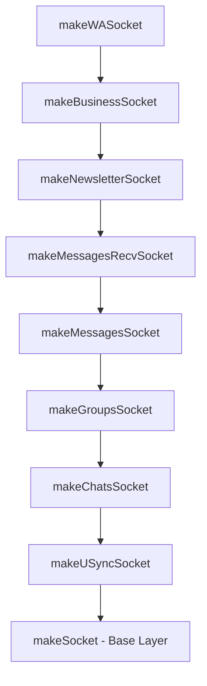
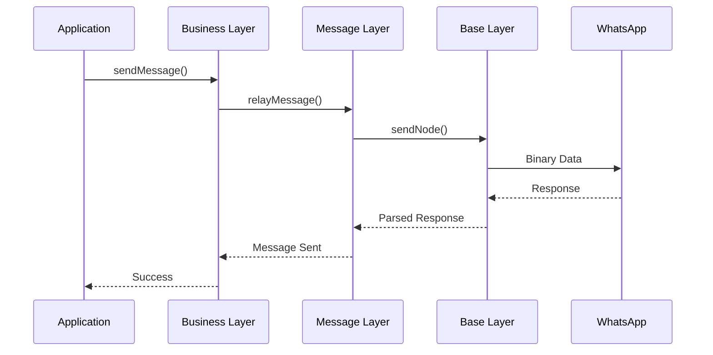

# Socket Layers Deep Dive

This document provides an in-depth look at each socket layer in Baileys, explaining their specific responsibilities and how they build upon each other.

## Layer Hierarchy



## Base Socket Layer (`socket.ts`)

The foundation layer that handles core WebSocket communication and authentication.

### Key Responsibilities

1. **WebSocket Connection Management**
   ```typescript
   const ws = new WebSocketClient(url, config)
   ws.connect()
   ```

2. **Noise Protocol Handshake**
   ```typescript
   const noise = makeNoiseHandler({
       keyPair: ephemeralKeyPair,
       NOISE_HEADER: NOISE_WA_HEADER,
       logger,
       routingInfo: authState?.creds?.routingInfo
   })
   ```

3. **Binary Protocol Handling**
   ```typescript
   const sendNode = (frame: BinaryNode) => {
       const buff = encodeBinaryNode(frame)
       return sendRawMessage(buff)
   }
   ```

4. **Authentication Flow**
   ```typescript
   const validateConnection = async () => {
       // Handshake process
       // Registration or login
       // Key exchange
   }
   ```

### Core Functions

| Function | Purpose | Usage |
|----------|---------|-------|
| `query()` | Send query and wait for response | `await query(node, timeout)` |
| `sendNode()` | Send binary node | `await sendNode(messageNode)` |
| `waitForMessage()` | Wait for specific message | `await waitForMessage(msgId)` |
| `generateMessageTag()` | Generate unique message ID | `const id = generateMessageTag()` |
| `uploadPreKeys()` | Upload encryption keys | `await uploadPreKeys()` |

### Events Emitted

- `connection.update`: Connection state changes
- `creds.update`: Authentication credentials updated

## USync Socket Layer (`usync.ts`)

Handles user synchronization operations for contacts and device management.

### Key Features

1. **User Synchronization Queries**
   ```typescript
   const executeUSyncQuery = async (usyncQuery: USyncQuery) => {
       // Build query with protocols and users
       // Send to WhatsApp servers
       // Parse and return results
   }
   ```

2. **Protocol Support**
   - Contact synchronization
   - Device list queries
   - Presence information

### Usage Example

```typescript
const usyncQuery = new USyncQuery({
    context: 'interactive',
    mode: 'query',
    protocols: [contactProtocol, deviceProtocol],
    users: [{ phone: '+1234567890' }]
})

const result = await sock.executeUSyncQuery(usyncQuery)
```

## Chats Socket Layer (`chats.ts`)

Manages chat metadata, app state synchronization, and privacy settings.

### Key Responsibilities

1. **App State Synchronization**
   ```typescript
   const resyncAppState = async (collections: WAPatchName[], isInitialSync?: boolean) => {
       // Sync app state with WhatsApp servers
       // Handle patches and updates
   }
   ```

2. **Chat Management**
   ```typescript
   const chatModify = async (modification: ChatModification, jid: string) => {
       // Archive, mute, pin chats
       // Mark as read/unread
       // Delete messages
   }
   ```

3. **Privacy Settings**
   ```typescript
   const fetchPrivacySettings = async (force?: boolean) => {
       // Get current privacy settings
       // Cache for performance
   }
   ```

### Processing Mutex

The chats layer introduces a processing mutex to ensure message order:

```typescript
const processingMutex = makeMutex()

processingMutex.mutex(async () => {
    // Process messages in order
    await upsertMessage(message, 'append')
})
```

### Events Added

- `chats.upsert`: New chats created
- `chats.update`: Chat metadata updated
- `chats.delete`: Chats deleted
- `presence.update`: User presence changes

## Groups Socket Layer (`groups.ts`)

Provides comprehensive group management functionality.

### Core Operations

1. **Group Creation**
   ```typescript
   const groupCreate = async (subject: string, participants: string[]) => {
       const key = generateMessageIDV2()
       const result = await groupQuery('@g.us', 'set', [
           {
               tag: 'create',
               attrs: { subject, key },
               content: participants.map(jid => ({
                   tag: 'participant',
                   attrs: { jid }
               }))
           }
       ])
       return extractGroupMetadata(result)
   }
   ```

2. **Participant Management**
   ```typescript
   const groupParticipantsUpdate = async (
       jid: string, 
       participants: string[], 
       action: ParticipantAction
   ) => {
       // Add, remove, promote, demote participants
   }
   ```

3. **Group Settings**
   ```typescript
   const groupSettingUpdate = async (jid: string, setting: GroupSetting) => {
       // announcement, not_announcement, locked, unlocked
   }
   ```

### Group Metadata Extraction

```typescript
const extractGroupMetadata = (result: BinaryNode): GroupMetadata => {
    const group = getBinaryNodeChild(result, 'group')!
    return {
        id: groupId,
        subject: group.attrs.subject,
        owner: group.attrs.creator,
        participants: extractParticipants(group),
        // ... other metadata
    }
}
```

### Events Added

- `groups.upsert`: New groups joined
- `groups.update`: Group metadata changed
- `group-participants.update`: Participant changes

## Messages Socket Layer (`messages-send.ts`)

Handles all message sending operations including media upload.

### Message Composition

1. **Message Generation**
   ```typescript
   const generateWAMessage = async (
       jid: string,
       content: AnyMessageContent,
       options: MiscMessageGenerationOptions
   ): Promise<proto.WebMessageInfo> => {
       // Generate message with proper structure
       // Handle different content types
       // Add metadata and options
   }
   ```

2. **Media Upload**
   ```typescript
   const waUploadToServer = getWAUploadToServer(config, refreshMediaConn)
   
   const uploaded = await waUploadToServer(
       stream,
       { mediaType, fileEncSha256, fileSha256, fileLength, signal }
   )
   ```

3. **Message Relay**
   ```typescript
   const relayMessage = async (
       jid: string,
       message: proto.IMessage,
       options: MessageRelayOptions
   ) => {
       // Encrypt message for recipients
       // Send to WhatsApp servers
       // Handle receipts
   }
   ```

### Content Processing

```typescript
const normalizeMessageContent = (content: AnyMessageContent): proto.IMessage => {
    // Handle different message types
    // Process media content
    // Apply transformations
}
```

### Device Management

```typescript
const getUSyncDevices = async (jids: string[]) => {
    // Get device lists for recipients
    // Cache for performance
    // Handle device updates
}
```

## Messages Receive Socket Layer (`messages-recv.ts`)

Processes incoming messages and handles message updates.

### Message Processing

1. **Incoming Message Handler**
   ```typescript
   const processMessage = async (message: proto.IWebMessageInfo) => {
       // Decrypt message content
       // Process different message types
       // Handle media messages
       // Emit events
   }
   ```

2. **Message Retry Logic**
   ```typescript
   const handleMessageRetry = async (retryNode: BinaryNode) => {
       // Handle failed message delivery
       // Retry with exponential backoff
       // Update message status
   }
   ```

3. **Poll Vote Decryption**
   ```typescript
   const processPollUpdate = async (pollUpdate: proto.IPollUpdate) => {
       // Decrypt poll votes
       // Aggregate results
       // Emit poll update events
   }
   ```

### Events Added

- `messages.upsert`: New messages received
- `messages.update`: Message status updates
- `messages.delete`: Messages deleted
- `message-receipt.update`: Receipt updates

## Newsletter Socket Layer (`newsletter.ts`)

Handles WhatsApp newsletter/channel functionality.

### Newsletter Operations

1. **Newsletter Management**
   ```typescript
   const newsletterCreate = async (name: string, description?: string) => {
       const variables = {
           input: { name, description: description ?? null }
       }
       return executeWMexQuery(variables, QueryIds.CREATE, XWAPaths.xwa2_newsletter_create)
   }
   ```

2. **Subscriber Management**
   ```typescript
   const newsletterFollow = (jid: string) => {
       return executeWMexQuery(
           { newsletter_id: jid }, 
           QueryIds.FOLLOW, 
           XWAPaths.xwa2_newsletter_follow
       )
   }
   ```

### WMex Query System

```typescript
const executeWMexQuery = async <T>(
    variables: Record<string, unknown>,
    queryId: string,
    dataPath: string
): Promise<T> => {
    // Execute GraphQL-like queries
    // Handle responses and errors
    // Parse results
}
```

## Business Socket Layer (`business.ts`)

The top layer providing WhatsApp Business features.

### Business Features

1. **Product Catalog**
   ```typescript
   const getCatalog = async (jid?: string, limit = 10) => {
       // Get business catalog
       // Parse product information
   }
   ```

2. **Order Management**
   ```typescript
   const getOrderDetails = async (orderId: string, tokenBase64: string) => {
       // Get order information
       // Handle order updates
   }
   ```

3. **Business Profile**
   ```typescript
   const getBusinessProfile = async (jid: string) => {
       // Get business information
       // Return profile data
   }
   ```

## Layer Communication

### Data Flow Between Layers



### Shared State

All layers share access to:
- `authState`: Authentication credentials and keys
- `ev`: Event emitter for communication
- `query`: Function to send queries to WhatsApp
- `logger`: Logging instance

## Best Practices

1. **Use Appropriate Layer**: Use the highest layer that provides the functionality you need
2. **Handle Events**: Always listen to relevant events for your use case
3. **Error Handling**: Implement proper error handling at each layer
4. **Resource Management**: Clean up resources and event listeners

## Next Steps

- **[Data Flow](./data-flow.md)**: Understand how data moves through the layers
- **[Authentication](../04-authentication/README.md)**: Learn about the authentication system
- **[Message System](../05-messages/README.md)**: Explore message handling in detail

---

> **Understanding the layers helps you choose the right level of abstraction for your needs and debug issues more effectively.**
