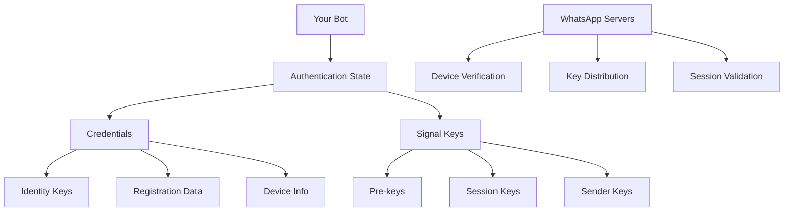
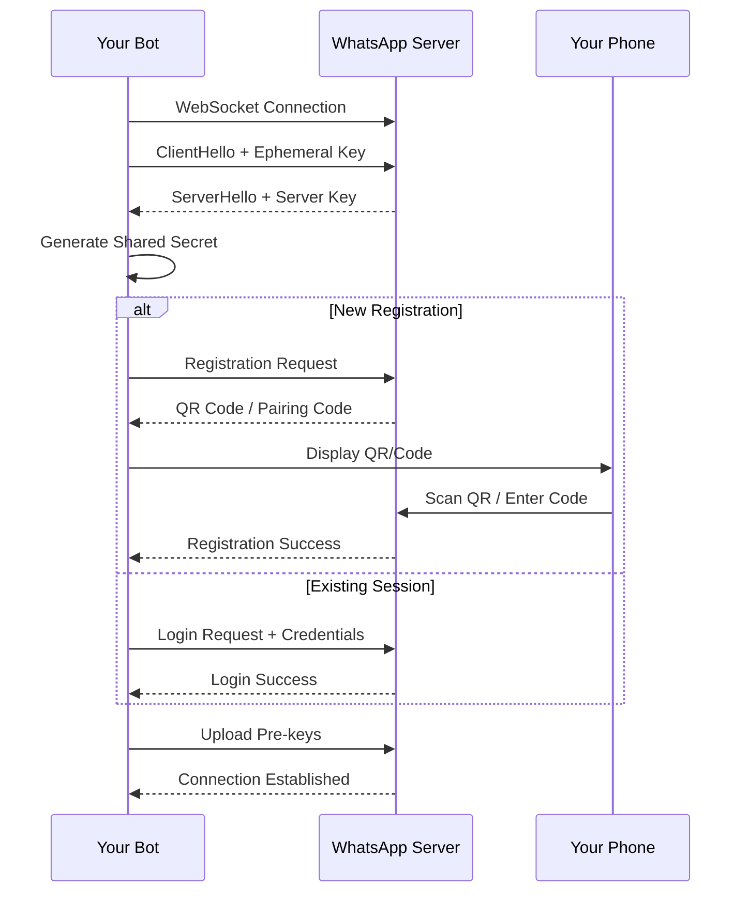

# Authentication System

Baileys implements a comprehensive authentication system that handles secure connections to WhatsApp Web. This guide explains how authentication works, session management, and different authentication methods.

## Overview

WhatsApp Web uses a multi-device authentication system where your bot acts as a linked device to your primary WhatsApp account. The authentication process involves:

1. **Initial Registration**: Linking your bot as a new device
2. **Session Management**: Maintaining authentication state
3. **Key Exchange**: Establishing encryption keys
4. **Connection Validation**: Verifying connection integrity

## Authentication Architecture



## Authentication State

The authentication state consists of two main components:

### 1. Credentials (`AuthenticationCreds`)

```typescript
interface AuthenticationCreds {
    // Core identity
    readonly noiseKey: KeyPair              // Connection encryption
    readonly signedIdentityKey: KeyPair     // Device identity
    readonly signedPreKey: SignedKeyPair    // Message encryption
    readonly registrationId: number         // Unique device ID
    
    // User information
    me?: Contact                            // Your WhatsApp contact info
    account?: proto.IADVSignedDeviceIdentity // Device identity proof
    
    // Session data
    firstUnuploadedPreKeyId: number         // Key management
    nextPreKeyId: number                    // Key generation
    lastAccountSyncTimestamp?: number       // Sync tracking
    
    // Connection state
    registered: boolean                     // Registration status
    pairingCode: string | undefined         // Pairing code for auth
    routingInfo: Buffer | undefined         // Connection routing
}
```

### 2. Signal Keys (`SignalKeyStore`)

```typescript
interface SignalKeyStore {
    get<T extends keyof SignalDataTypeMap>(
        type: T, 
        ids: string[]
    ): Promise<{ [id: string]: SignalDataTypeMap[T] }>
    
    set(data: SignalDataSet): Promise<void>
    clear?(): Promise<void>
}

type SignalDataTypeMap = {
    'pre-key': KeyPair                      // One-time keys
    'session': Uint8Array                   // Session state
    'sender-key': Uint8Array                // Group encryption
    'sender-key-memory': { [jid: string]: boolean }
    'app-state-sync-key': proto.Message.IAppStateSyncKeyData
    'app-state-sync-version': LTHashState
}
```

## Authentication Methods

### Method 1: QR Code Authentication

The most common method where you scan a QR code with your phone.

```typescript
import makeWASocket, { useMultiFileAuthState } from '@whiskeysockets/baileys'

async function connectWithQR() {
    const { state, saveCreds } = await useMultiFileAuthState('auth_info')

    const sock = makeWASocket({
        auth: state,
        printQRInTerminal: true,  // Show QR in terminal
        browser: ['MyBot', 'Chrome', '1.0.0']  // Custom browser info
    })

    const handleConnectionUpdate = (update) => {
        const { connection, lastDisconnect, qr } = update

        if (qr) {
            console.log('QR Code received, scan with your phone')
            // You can also generate QR code image here
        }

        if (connection === 'open') {
            console.log('Connected successfully!')
        }

        if (connection === 'close') {
            // Clean up event listeners before reconnecting
            sock.ev.off('connection.update', handleConnectionUpdate)
            sock.ev.off('creds.update', saveCreds)

            const shouldReconnect = lastDisconnect?.error?.output?.statusCode !== DisconnectReason.loggedOut

            if (shouldReconnect) {
                console.log('Connection closed, reconnecting...')
                setTimeout(() => connectWithQR(), 3000) // Reconnect after 3 seconds
            }
        }
    }

    sock.ev.on('connection.update', handleConnectionUpdate)
    sock.ev.on('creds.update', saveCreds)

    return sock
}
```

### Method 2: Pairing Code Authentication

Alternative method using a 8-digit pairing code.

```typescript
async function connectWithPairingCode() {
    const { state, saveCreds } = await useMultiFileAuthState('auth_info')

    const sock = makeWASocket({
        auth: state,
        printQRInTerminal: false,  // Disable QR code
        browser: ['MyBot', 'Chrome', '1.0.0']
    })

    // Request pairing code if not registered
    if (!sock.authState.creds.registered) {
        const phoneNumber = '+1234567890'  // Your phone number
        const code = await sock.requestPairingCode(phoneNumber)
        console.log(`Pairing code: ${code}`)

        // User enters this code in WhatsApp > Linked Devices > Link with phone number
    }

    const handleConnectionUpdate = (update) => {
        const { connection, lastDisconnect } = update

        if (connection === 'open') {
            console.log('Connected with pairing code!')
        }

        if (connection === 'close') {
            // Clean up event listeners before reconnecting
            sock.ev.off('connection.update', handleConnectionUpdate)
            sock.ev.off('creds.update', saveCreds)

            const shouldReconnect = lastDisconnect?.error?.output?.statusCode !== DisconnectReason.loggedOut

            if (shouldReconnect) {
                console.log('Connection closed, reconnecting...')
                setTimeout(() => connectWithPairingCode(), 3000) // Reconnect after 3 seconds
            }
        }
    }

    sock.ev.on('connection.update', handleConnectionUpdate)
    sock.ev.on('creds.update', saveCreds)

    return sock
}
```

## Session Management

### Using Multi-File Auth State

The recommended approach for production applications:

```typescript
import { useMultiFileAuthState } from '@whiskeysockets/baileys'

const { state, saveCreds } = await useMultiFileAuthState('auth_info_folder')

// This creates/uses a folder structure:
// auth_info_folder/
// ├── creds.json                 // Main credentials
// ├── pre-key-1.json            // Pre-keys
// ├── pre-key-2.json
// ├── session-1234567890@s.whatsapp.net.json  // Sessions
// └── ...
```

### Custom Auth State Implementation

For database storage or custom requirements:

```typescript
import { AuthenticationState, SignalDataSet } from '@whiskeysockets/baileys'

class DatabaseAuthState implements AuthenticationState {
    creds: AuthenticationCreds
    keys: SignalKeyStore
    
    constructor() {
        this.creds = this.loadCredsFromDB()
        this.keys = {
            get: async (type, ids) => {
                return this.loadKeysFromDB(type, ids)
            },
            set: async (data) => {
                await this.saveKeysToDB(data)
            }
        }
    }
    
    private loadCredsFromDB(): AuthenticationCreds {
        // Load from your database
    }
    
    private async loadKeysFromDB(type: string, ids: string[]) {
        // Load keys from database
    }
    
    private async saveKeysToDB(data: SignalDataSet) {
        // Save keys to database
    }
}
```

## Connection Process

### 1. Initial Handshake



### 2. Key Exchange Process

```typescript
// Simplified key exchange flow
const validateConnection = async () => {
    // 1. Generate ephemeral key pair
    const ephemeralKeyPair = Curve.generateKeyPair()
    
    // 2. Send client hello
    const helloMsg = {
        clientHello: { ephemeral: ephemeralKeyPair.public }
    }
    
    // 3. Receive server hello and process handshake
    const handshake = await sendHandshakeMessage(helloMsg)
    const keyEnc = await noise.processHandshake(handshake, creds.noiseKey)
    
    // 4. Send registration or login payload
    if (!creds.me) {
        await sendRegistrationPayload()
    } else {
        await sendLoginPayload()
    }
    
    // 5. Upload pre-keys for message encryption
    await uploadPreKeys()
}
```

## Security Features

### 1. End-to-End Encryption

Baileys implements the Signal protocol for message encryption:

```typescript
// Message encryption
const encryptedMessage = await signalRepository.encryptMessage({
    jid: recipientJid,
    data: messageBuffer
})

// Message decryption
const decryptedMessage = await signalRepository.decryptMessage({
    jid: senderJid,
    type: 'pkmsg', // or 'msg'
    ciphertext: encryptedContent
})
```

### 2. Key Rotation

Pre-keys are automatically rotated for forward secrecy:

```typescript
const uploadPreKeysToServerIfRequired = async () => {
    const preKeyCount = await getPreKeyCount()
    
    if (preKeyCount < MIN_PREKEY_COUNT) {
        const newPreKeys = generatePreKeys(PREKEY_UPLOAD_COUNT)
        await uploadPreKeys(newPreKeys)
    }
}
```

### 3. Device Verification

Each device has a unique identity that's cryptographically verified:

```typescript
const signedDeviceIdentity = encodeSignedDeviceIdentity({
    details: deviceDetails,
    accountSignatureKey: creds.signedIdentityKey.public,
    accountSignature: signature,
    deviceSignature: deviceSignature
})
```

## Authentication Events

### Connection State Events

```typescript
sock.ev.on('connection.update', (update) => {
    const { connection, lastDisconnect, qr, isNewLogin } = update
    
    switch (connection) {
        case 'connecting':
            console.log('Connecting to WhatsApp...')
            break
            
        case 'open':
            console.log('Connected successfully!')
            if (isNewLogin) {
                console.log('New login detected')
            }
            break
            
        case 'close':
            const shouldReconnect = lastDisconnect?.error?.output?.statusCode !== DisconnectReason.loggedOut
            console.log('Connection closed:', lastDisconnect?.error)
            
            if (shouldReconnect) {
                // Reconnect logic
            }
            break
    }
    
    if (qr) {
        console.log('QR Code:', qr)
        // Generate QR code image or display in terminal
    }
})
```

### Credential Updates

```typescript
sock.ev.on('creds.update', () => {
    // Save updated credentials
    saveCreds()
})
```

## Error Handling

### Common Authentication Errors

```typescript
import { DisconnectReason } from '@whiskeysockets/baileys'

const handleConnectionError = (error: any) => {
    const statusCode = error?.output?.statusCode
    
    switch (statusCode) {
        case DisconnectReason.badSession:
            console.log('Bad session, need to re-authenticate')
            // Delete auth state and restart
            break
            
        case DisconnectReason.connectionClosed:
            console.log('Connection closed, retrying...')
            // Retry connection
            break
            
        case DisconnectReason.connectionLost:
            console.log('Connection lost, reconnecting...')
            // Reconnect
            break
            
        case DisconnectReason.loggedOut:
            console.log('Logged out, need manual re-authentication')
            // Don't auto-reconnect
            break
            
        case DisconnectReason.restartRequired:
            console.log('Restart required')
            // Restart the connection
            break
            
        case DisconnectReason.timedOut:
            console.log('Connection timed out')
            // Retry with backoff
            break
    }
}
```

### Session Recovery

```typescript
const recoverSession = async () => {
    try {
        // Try to load existing session
        const { state } = await useMultiFileAuthState('auth_info')
        
        if (state.creds.registered) {
            // Attempt to connect with existing session
            return await connectWithExistingSession(state)
        } else {
            // Need fresh authentication
            return await connectWithNewAuth()
        }
    } catch (error) {
        console.log('Session recovery failed:', error)
        // Fall back to new authentication
        return await connectWithNewAuth()
    }
}
```

## Best Practices

### 1. Secure Storage

```typescript
// Encrypt sensitive data
import crypto from 'crypto'

const encryptAuthData = (data: string, password: string): string => {
    // Validate key length (should be 32 bytes for AES-256)
    const key = crypto.scryptSync(password, 'salt', 32)
    const iv = crypto.randomBytes(16)

    const cipher = crypto.createCipheriv('aes-256-cbc', key, iv)
    let encrypted = cipher.update(data, 'utf8', 'hex')
    encrypted += cipher.final('hex')

    // Prepend IV to encrypted data
    return iv.toString('hex') + ':' + encrypted
}

const decryptAuthData = (encryptedData: string, password: string): string => {
    const [ivHex, encrypted] = encryptedData.split(':')
    const iv = Buffer.from(ivHex, 'hex')
    const key = crypto.scryptSync(password, 'salt', 32)

    const decipher = crypto.createDecipheriv('aes-256-cbc', key, iv)
    let decrypted = decipher.update(encrypted, 'hex', 'utf8')
    decrypted += decipher.final('utf8')

    return decrypted
}
```

### 2. Session Validation

```typescript
const validateSession = (creds: AuthenticationCreds): boolean => {
    return !!(
        creds.registered &&
        creds.me &&
        creds.signedIdentityKey &&
        creds.signedPreKey
    )
}
```

### 3. Graceful Reconnection

```typescript
const connectWithRetry = async (maxRetries = 5) => {
    for (let attempt = 1; attempt <= maxRetries; attempt++) {
        try {
            await connect()
            return // Success
        } catch (error) {
            console.log(`Connection attempt ${attempt} failed:`, error)
            
            if (attempt === maxRetries) {
                throw new Error('Max connection attempts reached')
            }
            
            // Exponential backoff
            await new Promise(resolve => setTimeout(resolve, Math.pow(2, attempt) * 1000))
        }
    }
}
```

## Next Steps

- **[Session Management](./session-management.md)**: Deep dive into session handling
- **[QR Code Authentication](./qr-code-auth.md)**: Detailed QR code implementation
- **[Pairing Code Authentication](./pairing-code-auth.md)**: Pairing code setup
- **[Message System](../05-messages/README.md)**: Learn about message handling

---

> **Security Note**: Always store authentication data securely and never share your session files. Each session is tied to a specific device and should be treated as sensitive information.
